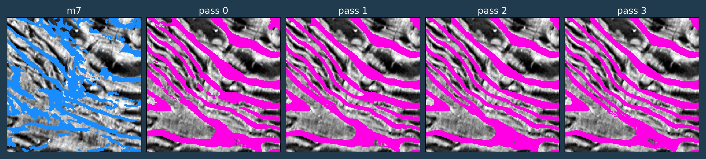
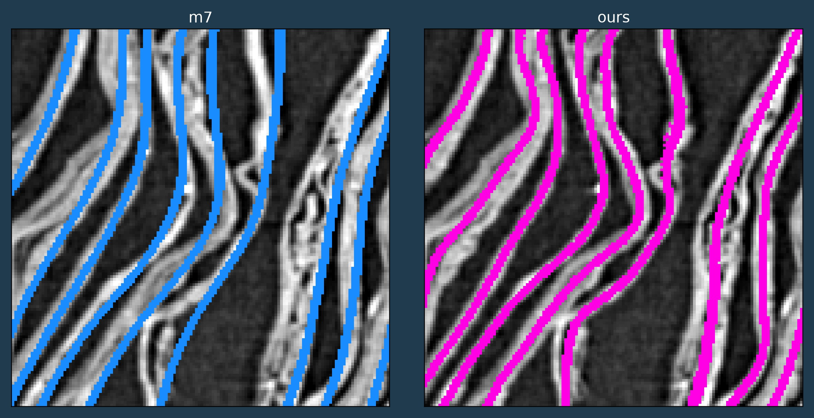
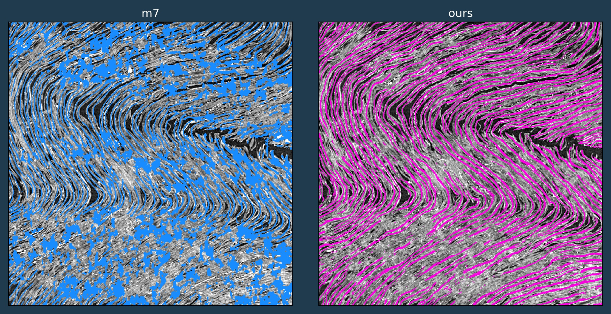

# HercUNet

📄 **[Read the paper (v0) → `paper_v0.pdf`](submission/writeup/paper_v0.pdf)** — the full write-up of both stages (HercuLabels + HercUNet), frozen as the first submission version.

🧠 **Model:** [`jimmylomro/hercunet-v0`](https://huggingface.co/jimmylomro/hercunet-v0) on 🤗 Hugging Face (warm-start / re-train with `hercunet train fit --pretrained-hf jimmylomro/hercunet-v0`) · 🗂️ **Training corpus:** [`jimmylomro/hercunet-corpus`](https://huggingface.co/datasets/jimmylomro/hercunet-corpus) — the 4031 stage-1 pseudo-label bundles + m7 rehearsal manifest we trained on.



**Cross-volume surface (sheet) detection for carbonised Herculaneum scrolls.**

> **⚠️ Faces vs medials — read before comparing.** HercUNet predicts the **medial** crest of each sheet (a thin
> surface at the sheet's centre, a few voxels inboard of the **faces** that all other labels — manual or m7-mined —
> annotate). This is a deliberate, different target, not an error, and it is why we report no Dice against face
> labels. Our stance: **it is better to have a sheet detection whose face lives flat at a few voxels' offset than
> one that is flat at zero offset only in some regions and waves harshly everywhere** — a consistent, correctable
> offset beats intermittent exactness. See the figure below.



Ink and text cannot be read until the papyrus sheets inside a scroll are correctly detected and
separated. Even if ink is detected on the wrapped volume, we need to unroll to read.
Existing surface detectors are trained per-corpus and don't generalise across volumes —
they **merge touching sheets** and **break thin ones**, topological errors that voxel-accuracy alone
never fixes. HercUNet attacks that with an **iterative refiner** trained on multi-scroll,
native-resolution pseudo-labels, running over a fast **streaming data layer** for teravoxel OME-Zarr
scroll volumes.

The project is built as a three-stage pipeline over one shared data layer, **piece by piece**, each
stage shipping with a visual tool that shows what it does.

## 📚 Documentation

**Install, GPU/CUDA setup, and CLI usage are in the docs guide → [`docs/README.md`](docs/README.md).**
Start there. Each part of the project also has its own guide under [`docs/`](docs/):

- **[Install & CLI](docs/README.md)** — requirements, `pipenv` install, CUDA build selection, the `hercunet` CLI. ✅
- **[Data layer](docs/data-layer.md)** — streaming OME-Zarr reads, caching, prefetch, tiling, with a quickstart. ✅
- **[Stage 1 — label generation](docs/herculabels.md)** — the `hercunet labels` CLI, the interactive grinding viewer, the `.herculabels` corpus format. ✅
- **Stage 2 — HercUNet refiner** — training + iterative inference CLI. 🚧 coming soon (methodology: [`submission/writeup/hercunet.md`](submission/writeup/hercunet.md)).

The **methodology** research write-ups: stage-1 (how the labels are derived) is
[`submission/writeup/herculabels.md`](submission/writeup/herculabels.md), and stage-2 (the iterative refiner) is
[`submission/writeup/hercunet.md`](submission/writeup/hercunet.md).

## Pipeline stages

| Stage | Module | Status |
|---|---|---|
| **Data layer** — streaming multiscale OME-Zarr reads (chunk-cache + parallel prefetch + material tiling) | `hercunet.data` | ✅ implemented |
| **Stage 1 — Pseudo-label generation** | `hercunet.labels` | ✅ implemented |
| **Stage 2 — Iterative refiner (HercUNet)** | `hercunet.refine` / `hercunet.infer` | 🚧 coming soon |

### Stage 1 - HercuLabels

Fully unsupervised sheet segmentation in small windows - specifically built for pseudo-label generation.

In short:

1. **CT window** — a small block of a scroll.
2. **Anisotropic diffusion** — coherence-enhancing diffusion cleans the substrate (sheets sharpen, gaps widen).
3. **Gradient field** — the density's structure tensor gives a per-voxel sheet-normal frame.
4. **Meshlets** — small oriented 2.5-D surface patches, grown along the field by tractography.
5. **Positive / negative selection** — a curvature-following slab picks same-sheet (green) and across-gap (red) pairs.
6. **Contrastive training** — those pairs train a low-D embedding: same-sheet meshlets collapse, adjacent wraps push apart.
7. **Clustering** — density clustering in the embedding recovers per-sheet instances.
8. **Sheets** — rasterised back to per-voxel sheet labels + honest confidence.
9. **Fine-tune m7 to validate** - check if HercuLabels carry signal - they do...

**Full methodology → [`submission/writeup/herculabels.md`](submission/writeup/herculabels.md).**

Try this, it's the window that started everything (you need to install with \[viz], check the installation guide):
```shell
pipenv run hercunet labels create /tmp/test.herculabels --scroll PHerc1447 --coords 11714,3293,3648 --interactive
```


This is a slow process - about 5 minutes per 192vx per-side cubes. It is best to run without `--interactive`,
and leave overnight. I created about 4000 of these in the cloud, and fine-tuned nnUNet without cleaning them.
But you can use the `merge` and `split` features to clean up your labels - not sure how that will work - I never tried.

This method allows for sheet-width, normal and sheet-membership supervision.
Also for topological augmentations like sheet merges and things like that, which I will explain in the HercUNet part.

### Stage 2 - HercUNet

A self-refining and growing sheet detection UNet architecture.

In short:

1. **m7 backbone** — start from the `m7` nnU-Net ResEnc plan and its trained weights.
2. **New inputs** — add the model's own previous output (`prev`) and a carried orientation field read from the CT's structure tensor (8-channel input: CT + `prev` + 6 orientation).
3. **Affinity head** — add an affinity output that drives instance separation.
4. **Loss stack** — supervise with symmetric Focal–Tversky (detection), a separation penalty, skeleton-recall (clDice), constrained MALIS on the affinity field, and a CT-material growth term.
5. **`prev` from labels** — a fixed fraction of the time, feed the HercuLabels (with their merge/split augmentations) as the `prev` input.
6. **Bootstrap** — zero the `prev` channel a fraction of the time, so the model also learns cold detection from the raw CT.
7. **DAgger** — condition on the model's *own* output as `prev`, not only on labels, so it learns to correct its own mistakes.
8. **Train** — about 500 epochs, warm-started from m7 weights.
9. **Iterate at inference** — run 3–4 passes, each taking the previous pass's output as `prev` (with the seam-free overlap blend).

**Full methodology → [`submission/writeup/hercunet.md`](submission/writeup/hercunet.md).**



## Status

The **data layer** and **stage-1 pseudo-label generation** (with its interactive viewer) are complete and
documented above; further pipeline stages are in development.
