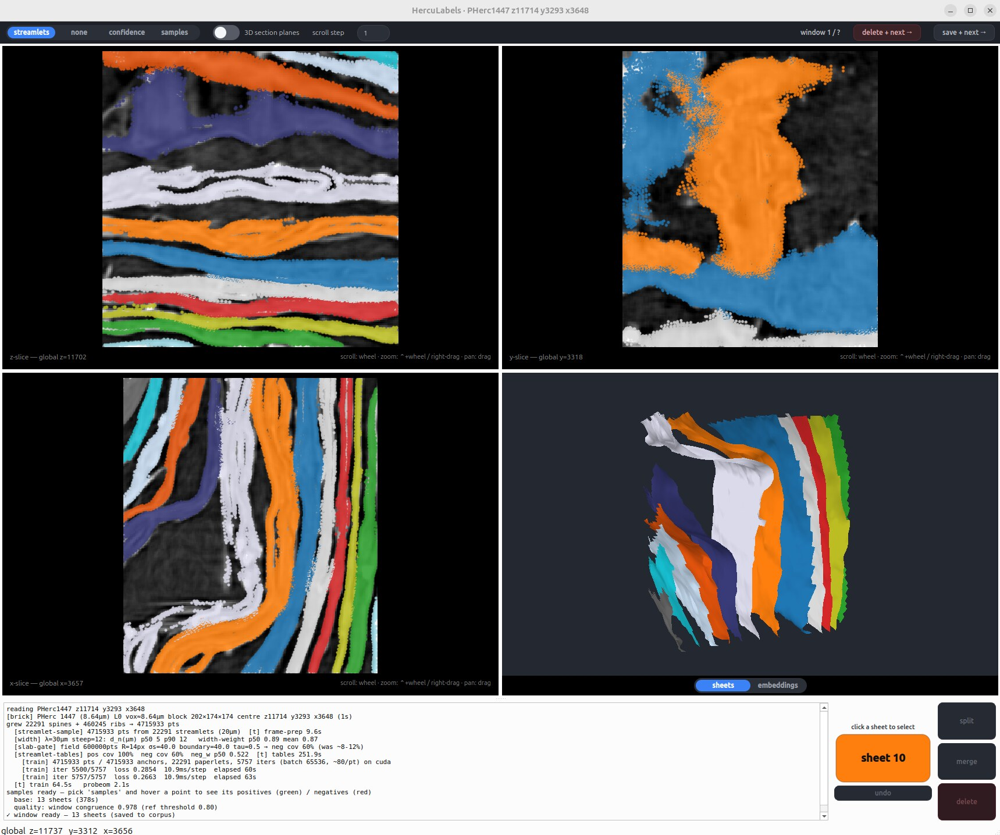

# HercUNet

**Cross-volume surface (sheet) detection for carbonised Herculaneum scrolls.**

Ink and text cannot be read until the papyrus sheets inside a scroll are correctly detected and
separated. Even if ink is detected on the wrapped volume, we need to unroll to read.
Existing surface detectors are trained per-corpus and don't generalise across volumes —
they **merge touching sheets** and **break thin ones**, topological errors that voxel-accuracy alone
never fixes. HercUNet attacks that with an **iterative refiner** trained on multi-scroll,
native-resolution pseudo-labels, running over a fast **streaming data layer** for teravoxel OME-Zarr
scroll volumes.

The project is built as a three-stage pipeline over one shared data layer, **piece by piece**, each
stage shipping with a visual tool that shows what it does.

## 📚 Documentation

**Install, GPU/CUDA setup, and CLI usage are in the docs guide → [`docs/README.md`](docs/README.md).**
Start there. Each part of the project also has its own guide under [`docs/`](docs/):

- **[Install & CLI](docs/README.md)** — requirements, `pipenv` install, CUDA build selection, the `hercunet` CLI. ✅
- **[Data layer](docs/data-layer.md)** — streaming OME-Zarr reads, caching, prefetch, tiling, with a quickstart. ✅
- **[Stage 1 — label generation](docs/herculabels.md)** — the `hercunet labels` CLI, the interactive grinding viewer, the `.herculabels` corpus format. ✅

The stage-1 **methodology** (how the labels are derived) is the research write-up
[`submission/writeup/herculabels.md`](submission/writeup/herculabels.md).

## Pipeline stages

| Stage | Module | Status |
|---|---|---|
| **Data layer** — streaming multiscale OME-Zarr reads (chunk-cache + parallel prefetch + material tiling) | `hercunet.data` | ✅ implemented |
| **Stage 1 — Pseudo-label generation** | `hercunet.labels` | ✅ implemented |

### Stage 1 - HercuLabels

Fully unsupervised sheet segmentation in small windows - specifically built for pseudo-label generation.

In short:

1. **CT window** — a small block of a scroll.
2. **Anisotropic diffusion** — coherence-enhancing diffusion cleans the substrate (sheets sharpen, gaps widen).
3. **Gradient field** — the density's structure tensor gives a per-voxel sheet-normal frame.
4. **Meshlets** — small oriented 2.5-D surface patches, grown along the field by tractography.
5. **Positive / negative selection** — a curvature-following slab picks same-sheet (green) and across-gap (red) pairs.
6. **Contrastive training** — those pairs train a low-D embedding: same-sheet meshlets collapse, adjacent wraps push apart.
7. **Clustering** — density clustering in the embedding recovers per-sheet instances.
8. **Sheets** — rasterised back to per-voxel sheet labels + honest confidence.
9. **Fine-tune m7 to validate** - check if HercuLabels carry signal - they do...

Try this, it's the window that started everything (you need to install with \[viz], check the installation guide):
```shell
pipenv run hercunet labels create /tmp/test.herculabels --scroll PHerc1447 --coords 11714,3293,3648 --interactive
```



This is a slow process - about 5 minutes per 192vx per-side cubes. It is best to run without `--interactive`,
and leave overnight. I created about 4000 of these in the cloud, and fine-tuned nnUNet without cleaning them.
But you can use the `merge` and `split` features to clean up your labels - not sure how that will work - I never tried.

This method allows for sheet-width, normal and sheet-membership supervision.
Also for topological augmentations like sheet merges and things like that, which I will explain in the HercUNet part.

### Stage 2 - HercUNet

Still writing...

## Status

The **data layer** and **stage-1 pseudo-label generation** (with its interactive viewer) are complete and
documented above; further pipeline stages are in development.
