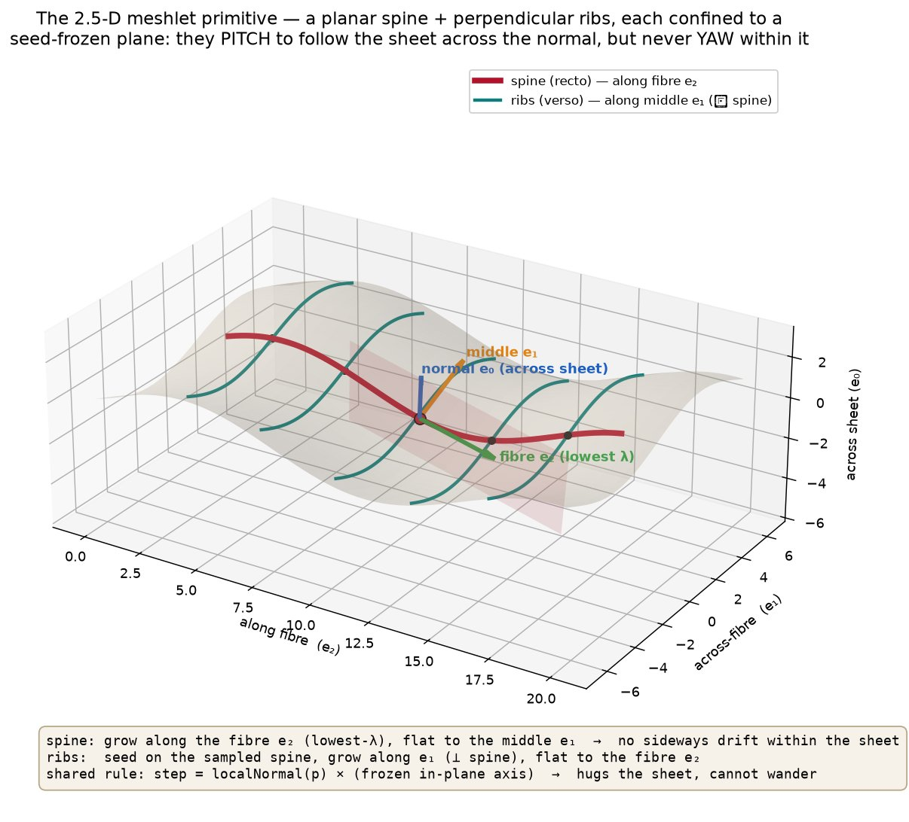
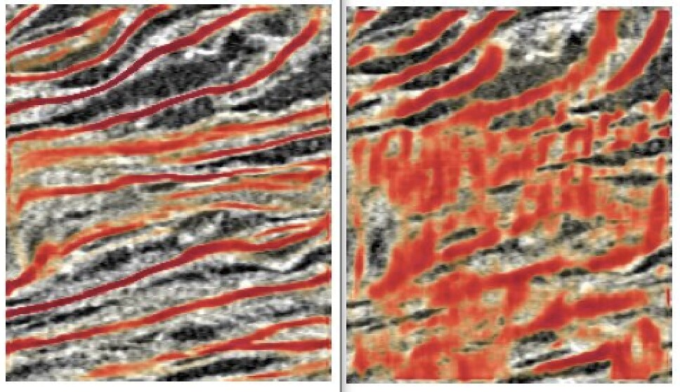
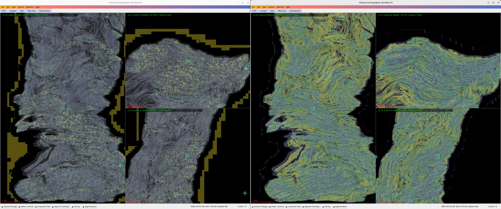
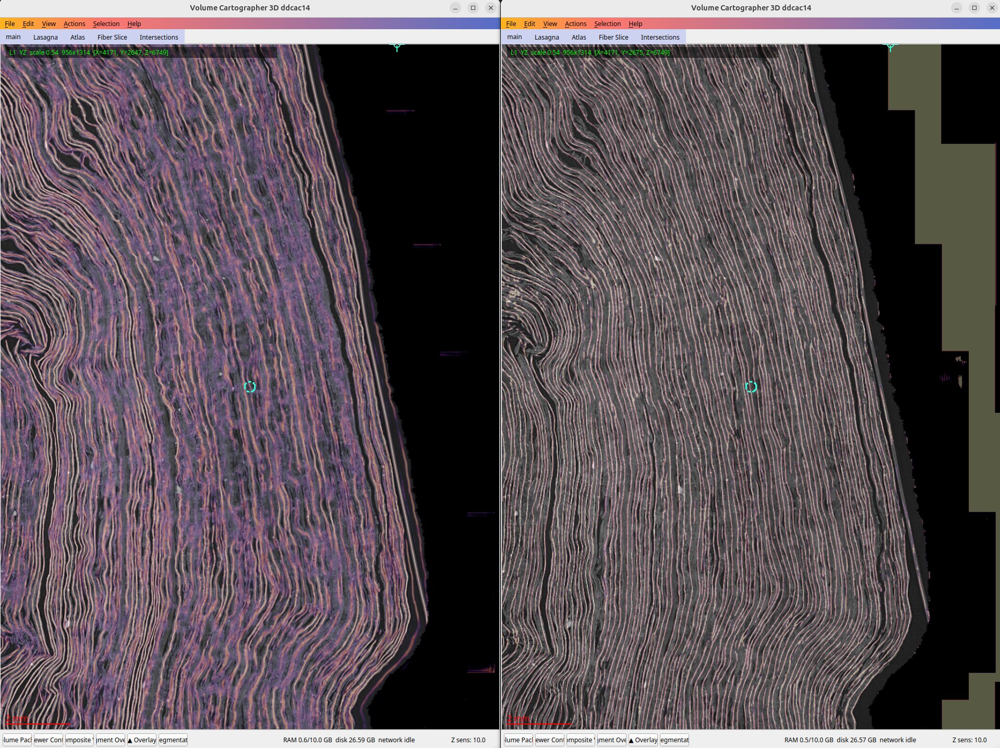
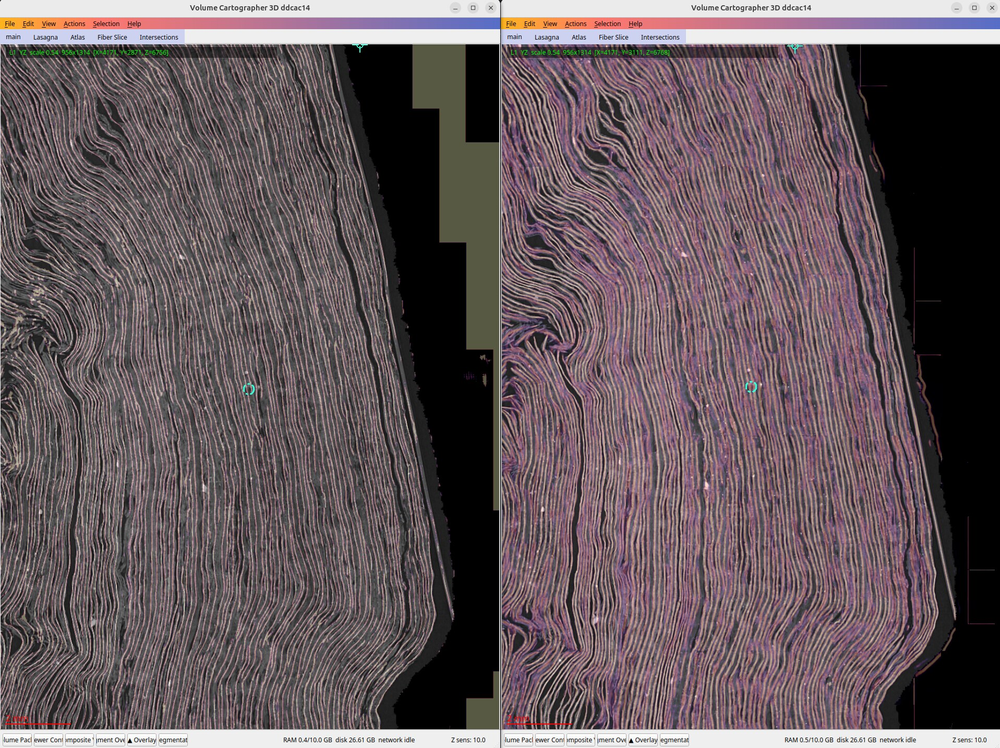

# Pseudo-label Generation

## Abstract

We present a method for *generating* pseudo-labels from the herculaneum scrolls.
This is achieved in a fully unsupervised way, at a quality high enough to train a nnUNet for sheet predictions.

We part from the idea that sheets are indistinguishable at a point but separable at another.
The central difficulty is one of measurement rather than of learning. Inside any small analysis window two
adjacent wraps of the spiral are locally indistinguishable — same fibre texture, same thickness, same
appearance — and the *only* thing that tells them apart is the thin gap between them, seen edge-on across the
sheet normal. A method that decides sheet membership from any single scalar cue (a density value, a coordinate)
is therefore fragile: wherever the sheets bend, fold, or are compressed together, that cue is fooled.

Our pipeline is built around that fact. From the raw micro-CT of a window we estimate a per-voxel orientation
**frame field**; along it we grow a small oriented surface **primitive** that is deliberately longer than the
inter-wrap spacing; between primitives we measure two geometric relations — *same-sheet* affinity and
*different-wrap* opposition — using an **anisotropic, curvature-following, asymmetric slab** that conforms to
the local material rather than to a fixed shape. These relations train a low-dimensional **contrastive
embedding** in which same-sheet primitives collapse together and adjacent wraps are pushed apart, so
the wraps arrange into an ordered ladder. The embedding is clustered with a **size-penalised density method**
that repairs the systematic over-merging of standard density clustering, and the resulting per-sheet clusters
are rasterised into the two fields the downstream refiner consumes: a surface crest and a per-voxel
**sheet-instance identity**, each accompanied by an honest per-voxel confidence. The design principle
throughout is that clean sheets with truthfully-marked uncertain regions are worth more than confidently-wrong
ones.

---

## 1. Setting and notation

We work on one analysis window at a time at a size bound by computing resources - usually cube of 192 voxels per side.
The raw intensity is first passed through a coherence-enhancing diffusion that sharpens the sheet ridges while
smoothing along them, giving a density field we treat as the substrate for everything that follows. Where we
need a direction we always mean the sheet **normal** n̂ — the direction across the sheet, along which
neighbouring wraps are separated — and by *in-plane* we mean the two directions tangent to the sheet.

---

## 2. The cleaned substrate and the orientation frame

Every later stage needs two things at every point: a clean local density, and the direction the sheet faces.
Both come from one operator — the **structure tensor** of the density — used first to clean the volume and then
to read the frame off it.

**The structure tensor.** At each voxel we differentiate the density with a derivative-of-Gaussian at a small
*noise* scale (so differentiation does not amplify the voxel grain) and take the outer product of the resulting
gradient — a 3×3 positive-semidefinite matrix. A lone gradient outer product is rank-one and noisy; the
structure tensor proper is obtained by **averaging** these outer products over a larger *integration*
neighbourhood, with a second Gaussian at the sheet scale. That averaging is the decisive step: individual
gradients on a fibre-textured sheet scatter in direction, but their averaged outer product has a dominant
eigenvector that points reliably **across** the sheet. Diagonalising it (ascending eigenvalues) yields an
orthonormal frame — the **largest**-eigenvalue eigenvector is the sheet **normal** n̂ (the direction of greatest
intensity change, across the sheet); the **smallest** is the **fibre** direction within the sheet plane; and the
anisotropy between the eigenvalues is a **coherence**, near one on a crisp sheet and near zero in noise or where
two orientations collide. The pair of scales — a small derivative scale and a larger integration scale — is
exactly what lets a single robust orientation survive the fibre texture.

**Cleaning the substrate (coherence-enhancing diffusion).** The raw CT is grainy and its inter-wrap gaps are
faint, which degrades every geometric estimate that follows. We therefore pre-clean it with a Weickert-style
**coherence-enhancing anisotropic diffusion** steered by the frame above. The principle is to let intensity flow
**freely within the sheet plane and essentially not at all across the normal**: the diffusion tensor is the
identity with its across-normal component suppressed to a tiny value (eigenvalue one along the two in-plane
tangents, ≪ 1 along n̂), so the flux is simply the ordinary gradient minus its across-normal part. Evolved for a
few explicit time steps — each small enough for numerical stability, with the steering frame re-estimated as the
edges sharpen — this smears each sheet into a clean, connected band while **widening and sharpening the gaps
between wraps**: the two properties on which the slab and the gap trace later depend. The diffusion is
destructive of fine detail by design and is used only to produce this geometric substrate, never as a detection
input; the frame field the rest of the pipeline uses is the structure tensor of *this cleaned density*.

**Why the frame is read from the CT, and sign-free.** The frame is derived, never learned, and computed from the
CT rather than from any prediction — precisely because where two wraps have visually merged the CT still carries
*both* orientations even though a detector would have fused them into one, and that surviving orientation
discontinuity is the very cue that later separates them. The normal is treated **sign-free**: within a local
window there is no information about which way the scroll's umbilicus lies, so any quantity that would flip under
n̂ → −n̂ is avoided throughout. This field is the ground on which the primitives are grown and the frame in which
the slab is evaluated.

---

## 3. The primitive: an oriented 2.5-D surface patch

We do not classify voxels directly. Instead we tile each sheet with a **primitive** — a small planar cross of a
**spine** and a set of perpendicular **ribs** — that samples the sheet's local tangent frame. Each arm is a
**streamline**: an integral curve of a direction field, traced from a seed by **fixed-step, second-order
Runge–Kutta (midpoint) integration**, growing both ways from the seed, sampling the field at each sub-step by
trilinear interpolation. What distinguishes our streamlines from ordinary fibre tractography is *which* field is
integrated and how it is constrained, and that is what keeps them faithfully on the sheet.

Recall the three structure-tensor eigenvectors at any point, ordered by eigenvalue: the **normal** e₀ (largest
eigenvalue, across the sheet), the **fibre** e₂ (smallest eigenvalue, the least-varying in-plane direction,
along the papyrus fibres), and the remaining in-plane **middle** direction e₁ (the second tangent, across the
fibres). A primitive is grown to lie in the sheet with each arm aligned to one of the two in-plane axes.

**Growing the spine.** A spine is seeded on high-coherence material, on a **40 µm** grid, and grown **along the
fibre** e₂. The trick
that keeps it on the sheet is to **freeze a plane at the seed** — the plane spanned by the seed's normal e₀ and
its fibre e₂, whose plane-normal is therefore the middle eigenvector e₁ — and to require the spine to stay both
*on the sheet* and *in that frozen plane* at every step. Concretely the step direction is the local sheet normal
crossed with the frozen plane-normal,

```
d(p) = localNormal(p) × e₁(seed),
```

which is by construction perpendicular to the local normal (so the spine rides the sheet surface) and
perpendicular to e₁ (so it stays in the frozen plane). Where the sheet is flat this reduces to the fibre
direction; where the sheet undulates, `d` **pitches** — it tilts across the normal to follow the surface up and
down — but it can **never yaw**, i.e. never rotate out of the frozen plane along e₁. Projected onto the seed's
tangent plane the spine is therefore a straight line along the fibre. Two further points matter: the step is
driven by the **local normal**, which is the most stable output of the structure tensor, rather than by the
fibre eigenvector directly (that eigenvector becomes ill-defined wherever the two in-plane eigenvalues are
close, and a streamline that follows it wanders); and each midpoint-integrated step (fixed length, **8 µm**) is
made **sign-coherent** (consecutive steps are prevented from flipping direction) and **gap-shy** — the trace
coasts through a few low-signal steps before terminating — so a spine drives straight through a locally
incongruent stretch instead of stopping at it. Growth halts at a bounded length of **250 µm** (per side of the
seed).

**Growing the ribs.** Ribs are the exact dual. They are seeded at **arc-length samples of the spine itself,
every 20 µm** — so every rib begins on a recto point — and grown along the **middle eigenvector** e₁, i.e.
*perpendicular to the spine*, with the same 8 µm midpoint step out to a shorter bounded length of **100 µm**
(per side). The rule is identical with the frozen plane-normal swapped from e₁ to the **fibre** e₂: the rib is
held flat in the fibre direction (it cannot yaw along the fibre) while it pitches across the normal to follow
the sheet. Ribs are gated on a **planarity** field rather than fibre-coherence, which makes them *less* shy than
the spine so they run straight across regions of low fibre congruency; each rib remembers its parent spine.

**Why one direction is held flat.** The single shared idea is that each arm grows freely along one in-plane axis
while its other in-plane degree of freedom is **frozen** — the spine is flat to e₁, each rib is flat to e₂. That
one constraint is what makes the primitive *hug* the sheet: an arm is free to bend across the normal (pitch) to
track the sheet's undulation, but it is forbidden from drifting sideways within the sheet plane (yaw). Without
it a streamline meanders within the sheet, loops back on itself, or slips across a faint gap onto the
neighbouring wrap wherever the in-plane orientation is ambiguous; with it the primitive stays a clean planar
cross whose two arms report the sheet's true local tangent frame.



Points are sampled along the spine and ribs at **20 µm** spacing to form a small cloud; each point is tagged by
which arm it came from — spine-derived (**recto**) or rib-derived (**verso**) — a distinction the embedding later
relies on. A primitive is a piece of geometry only; it is never treated as a node in a graph, and no
connectivity is asserted between primitives at this stage.

A single window tiles into a large number of primitives: of order **twenty thousand spines** and a few hundred
thousand ribs, sampling to a few million points, of which — because ribs are short and dense — only about
**10 % are recto (spine) and 90 % verso (rib)**, an imbalance that later has to be corrected explicitly. The
three length scales above (40 µm seed grid, 20 µm point spacing, and the 250 / 100 µm arm lengths) were not
tuned for accuracy alone: we **swept the seed stride and the sampling distance** and settled on the values that
keep a window's generation tractable — sparser seeds and coarser sampling both shrink the point cloud and speed
everything downstream — while still resolving the sheets cleanly. They are a deliberate quality-vs-runtime
operating point, not a fundamental limit.

Two properties make the primitive the right unit. It is **oriented**, so the slab that measures relations
between primitives can be posed in the sheet's own frame; and it is **longer than the merge** it must survive —
a patch that spans more than the inter-wrap gap cannot be fully explained by a single wrong wrap, so the
information needed to separate two wraps is present within the primitive rather than only across many of them.

---

## 4. The surface slab — the central measurement

All membership decisions reduce to one question asked of a pair of points: *does the candidate lie on the same
sheet as the anchor?* We answer it with a **slab** — a soft, thin, sheet-shaped region attached to the anchor,
inside which a candidate scores high and outside which it scores low. The slab is the core measurement
primitive of the whole method, and getting its shape right is what lets the pipeline follow curved and
compressed sheets without leaking onto their neighbours. The same slab machinery serves both relations: a
**positive** pulls same-sheet points together (this section), and a **negative** pushes the adjacent wrap away
(Section 5).


### 4.1 The slab: an anisotropic Gaussian in the surface frame

Let the anchor (one of the points sampled at the spines) sit at a point with unit normal n̂,
and let a candidate be reached by the offset vector **v**.
In the anchor's local **Darboux frame** — the two in-plane tangents together with the normal — we split **v** into
a signed distance **across** the sheet and the residual **in-plane** displacement:

- across-normal distance: `dₙ = v · n̂`
- in-plane residual: `v∥ = v − dₙ n̂`, with in-plane distance `ρ = |v∥|`.

The slab score is then an **anisotropic Gaussian** in this frame — equivalently `exp(−d²)` for a **Mahalanobis
distance** `d` whose diagonal metric is generous in-plane and tight across the normal:

```
S(anchor → candidate) = exp( − ρ²/σ_s²  −  dₙ²/σ_n² ),      σ_n ≪ σ_s
```

a Gaussian kernel with in-plane width `σ_s` and a much smaller across-normal width `σ_n`. A point on the same
flat sheet has `dₙ ≈ 0` and any `ρ`, and scores near one; a point on the adjacent wrap has a large `|dₙ|` and is
cut off. This anisotropy is the whole point — an isotropic neighbourhood cannot tell a far same-sheet point from
a near adjacent-wrap point. Two refinements turn this idealised form into the slab we actually use: the raw `dₙ`
is replaced by a curvature-corrected distance so the slab follows a bending sheet (§4.2), and the single width
`σ_n` is made two-sided and material-adaptive (§4.3).

### 4.2 Following the curvature

Sheets are not flat, and a naïve across-normal test punishes a curved sheet's own far parts as if they had
stepped off it. We correct for this using the local **shape operator** — the spatial derivative of the normal
field at the anchor (its Jacobian). From it we read the normal curvature `κ` in the direction of `v∥`, and
replace the raw `dₙ` with a curvature-corrected across-normal distance that measures displacement from the
osculating (best-fitting curved) sheet rather than from the flat tangent plane:

```
r = ( dₙ − ½ κ ρ² ) / √( 1 + κ² ρ² ).
```

The `½ κ ρ²` term is exactly how far the curved sheet has itself risen off its tangent plane at in-plane
distance `ρ`, so a point that simply follows the bend keeps `r ≈ 0` and stays inside the slab; only a point
that genuinely crosses the gap earns a large `r`. This is what lets the slab hug a rolling sheet instead of
slicing a chord through it.

### 4.3 The asymmetric across-normal width

Putting §4.2 into the slab of §4.1 — the curvature-corrected `r` in place of the raw `dₙ` — gives the score we
actually evaluate,

```
S(anchor → candidate) = exp( − ρ²/σ_s²  −  r²/σ_n² ),
```

with an isotropic in-plane reach `σ_s` (of order the primitive's own scale, ~180 µm) and an across-normal
half-width `σ_n` that is the delicate part. A single fixed `σ_n` is wrong for two reasons: near a tight gap it
bleeds onto the neighbour, and it ignores that the material around the medial surface is **not symmetric** —
the distance to the ridge edge, and to the next wrap, generally differs on the two sides of the sheet.

We therefore make the width **two-sided and material-adaptive**. At the anchor we sample the density outward
along `+n̂` and, separately, along `−n̂`, and on each side we find the first point where the density has fallen
below a fixed fraction of its value at the anchor — the local ridge edge, i.e. the beginning of the gap to
whatever is on that side. The across-normal half-width for that side is a fixed fraction of that edge distance,
clamped to a small range so it can only ever **tighten** below the default (near edges and tight gaps) and
never widen beyond it (a sheet with clear space on a side falls back to the cap). The slab then uses `σ_n⁺` for
candidates on the positive-normal side (`dₙ ≥ 0`) and `σ_n⁻` for the negative side. The result is an
**asymmetric slab** that conforms to the true material envelope: it is allowed to reach further on the open
side of a sheet and is pulled in on the crowded side, so it never crosses a gap that the density says is there,
on either face independently.

### 4.4 From the slab to positive (same-sheet) pairs

An anchor's slab tells us which candidates *it* considers same-sheet, but that alone is not enough — an
adjacent wrap sitting across the normal can fall inside one sheet's generous in-plane reach. We therefore
require **mutuality**: a pair counts as a positive only if the candidate lies in the anchor's slab **and** the
anchor lies in the candidate's slab, each evaluated in its *own* frame. The affinity weight is the product of
the two slab scores. Mutuality is what structurally rejects the neighbour: relative to the wrap across the gap,
one sheet's slab may reach it, but the neighbour's own slab — posed in the neighbour's frame, with its normal
pointing back — does not reach the anchor, so the product collapses.

One further safeguard is applied only as a **down-weighting, never a repulsion**: a soft attenuation that fades
a positive as its across-normal distance grows, so a spurious link that tries to glue across a small step is
weakened. It is deliberately one-directional (it can stop a bad glue but can never push two things apart),
which keeps it **fold-safe** — a genuine fold, where the sheet doubles back through continuous material, is
never torn, because the fold is held together by its in-plane path even as the across-normal attenuation fades.

---

## 5. Opposition across the gap — the negatives

Pulling same-sheet points together is not sufficient to separate wraps; something must actively **push the
adjacent wrap away**. Choosing those repulsive (negative) pairs correctly is the single hardest part of the
method, and it went through three generations. Describing all three is worthwhile because the failure of the
first is what motivates the shape of the third.

### 5.1 The corridor (the failed first attempt)

The first approach reasoned purely across the normal: from each patch, take **any** other patch displaced by
more than about one wrap-thickness along the local normal, and call it a negative. The stated justification was
that a same-sheet point projects to near-zero across-normal distance and so excludes itself. On a **flat**
sheet this holds; on a **curved** one it does not. A bent sheet lifts its own far parts off the tangent plane
(the same `½κρ²` rise the slab corrects for), so those far parts project a large across-normal distance and are
swept up as false negatives. The embedding then pushes a sheet **apart from itself**, and sheets fragment.
The corridor had no notion of a gap; it only measured across-normal distance, and across-normal distance is
exactly the quantity curvature corrupts.

### 5.2 Gap-gating (the working method, used to generate the corpus)

The fix is to fire a negative **only where there is a demonstrable physical gap**, and to place it on the far
side of that gap rather than near the anchor. The whole rule operates on the **relative density profile** sampled
outward along the normal from the anchor — the density along the ray, normalised by its value at the anchor, so
the test is contrast-independent:

```
rel(t) = d(anchor + t·n̂) / d(anchor),      t = 0, 2, 4, … µm  (both normal sides).
```

**The valley-then-rise gate.** A side fires only if three conditions hold *together*: the local material
genuinely ends (the adaptive across-normal width has tightened below its cap, `σ_n < σ_max`); the profile
**falls into a valley**, `rel(t) < τ` at some `t` beyond a conservative gate `t ≥ max(margin_k·σ_n, t_floor)`
(so the anchor's own tail is never read as a gap); and it then **rises again**, `rel(t′) ≥ τ_nb` at some
`t′ > t`, into the neighbouring ridge. In words: *material → gap → material*. With `τ ≈ 0.3` and `τ_nb ≈ 0.5`
(and `t_floor ≈ 15 µm`, `margin_k ≈ 2.5`), this is a **matched criterion for exactly one inter-wrap gap**. If
the profile simply continues — through a fold, or through solidly compressed material with no valley — no
negative is produced, so the method is **fold-safe by construction**.

**The gather point.** The distance of the neighbour rise, `D = t′`, is the measured local **pitch** to the next
wrap, and the negative is gathered at the **far ridge**: we query the point cloud for the nearest patches to

```
c = anchor + D·n̂        (the "blob centre"),
```

not to the anchor. Those nearest-to-`c` patches *are* the adjacent wrap. (Gathering near the anchor instead — as
one naturally would — returns the anchor's own in-plane neighbourhood, which never reaches across the gap; that
mistake once produced essentially zero negative coverage.)

**The weight.** Each gathered candidate `q` is scored by a **separable anisotropic kernel** in the normal-ray
frame, decomposing `q − anchor` into an along-normal projection `proj` and a perpendicular offset `perp`:

```
neg_w(q) = exp(−depth/σ_d) · exp(−½ (perp/σ_ip)²) · exp(−proj/λ).
```

The three factors have distinct roles: a **depth gate** `exp(−depth/σ_d)` on how deep the valley fell (deeper
gap ⇒ stronger push; a shallow, same-sheet valley ⇒ ≈ 0, which is what makes it fold-safe); a **Gaussian across
the ray** `exp(−½(perp/σ_ip)²)` that keeps the push on-axis (`σ_ip ≈ 40 µm`); and an **exponential decay along
the ray** `exp(−proj/λ)` that favours the nearest wrap (`λ ≈ 60 µm`). It is the exact dual of the positive slab:
where the positive is an anisotropic **Gaussian** centred on the anchor and tight across the normal, the
negative is an anisotropic kernel centred on the **far ridge**, Gaussian on-axis and exponentially near-favouring.

**Ordinality for free.** Because the trace stops at the *first* valley-then-rise, the negative always lands on
the **immediately** adjacent wrap and never skips one — the property that later gives the embedding its natural
ordering (Section 6).

This gap-gated selection, on the two-sided asymmetric slab frame, is the method that generated the entire label
corpus.

![The gap-gated negative. Left: from the anchor the density is traced along the normal; a negative fires only on a valley-then-rise (material → gap → material), and the push is gathered at the far ridge c = anchor + D·n̂ where the profile rises, weighted by a kernel that is Gaussian across the ray and exponentially near-favouring along it. Right: the relative profile rel(t) with the valley threshold τ, the neighbour-rise threshold τ_nb, the conservative gate, the valley depth, and the measured pitch D.](../images/gap_gated_negative.jpg)

### 5.3 The slab-field refinement (the current improvement)

Gap-gating has one weakness in the very regions we care about most: where wraps are crushed together, the raw
density between them stays grey rather than dropping to a clean valley, and the trace's boundary test — which
requires the local across-normal width to be *below* its cap before it will even look for a valley — rejects
the thick, saturated material outright. In such windows only a small fraction of anchors ever obtain a
negative, and residual merges survive.

The improvement makes the gap **visible** before gating on it. Instead of tracing the raw density, we first
**splat every patch's asymmetric slab into a shared volume** — an orientation-aware accumulation in which each
point contributes mass shaped like its own thin slab. Because the slabs are thin across the normal, the
compressed inter-wrap space, which was merely grey in the raw density, becomes a **deep valley** in the
accumulated field: the anisotropy manufactures the contrast that the raw contrast lacked. On this field the
valley test fires where it could not before. Two smaller changes accompany it — the boundary test is decoupled
from the tightness cap so thick sheets are no longer rejected before their valley is checked, and the valley
threshold is relaxed — and together they raise negative coverage in compressed windows several-fold with no
regression on windows that were already clean. This is the version intended for future label generation; the
existing corpus predates it.

### 5.4 The honest limit

Where two wraps genuinely **touch**, with no valley between them at any scale, no density-based cue can
separate them — the winding simply continues and the normal flips across the fold. This is a topological fact,
not a tuning failure, and no amount of slab refinement addresses it. Rather than emit a confident but wrong
boundary there, the pipeline marks those regions **low-confidence** (Section 9) and leaves the true fix to an
orientation/continuity signal that is out of this stage's scope.

---

## 6. The contrastive embedding

The two relations — same-sheet affinity and across-gap opposition — are used to train a small embedding that
assigns **one vector per primitive** (each spine and its ribs share a single vector) in a low-dimensional space:
**eight dimensions**, because the relations' effective rank is only a few and a compact space clusters far more
cleanly than a wide one. A typical window carries of order **twenty thousand** such vectors.

**The training scheme.** The slab tables give each anchor a shortlist of candidates — up to ~48 positives and
~32 negatives — but we do not use them all every step. Training is stochastic with a fixed gradient budget:
each step draws a large batch of anchors and, for each, samples a **small group of a few pairs** — *one recto
positive, one verso positive* (each ∝ its mutual slab weight) and *one gap negative* (∝ its push weight) — and
takes one Adam step. Over training each anchor is visited on the order of a hundred times, so every primitive
sees many different same-sheet partners and adjacent-wrap opponents without ever materialising the full
pair graph. The anchors are the sample points themselves (a few million per window, ~10 % recto / ~90 % verso).

**The loss.** Four terms are summed each step, the first two the working forces and the last two a faint
regulariser borrowed from **VICReg** (variance–invariance–covariance regularisation):

- **Invariance (pull)** — the mean squared distance from the anchor to each of its drawn positives, `‖z_a −
  z_p‖²`. Always on; it is the sheet-cohesion force.
- **Push** — a hinge on the distance to the drawn gap negative, `relu(margin − ‖z_a − z_neg‖)`, weighted by the
  negative's strength and applied only where a gap actually fired. It separates the adjacent wrap.
- **Variance** — a per-dimension floor, `relu(1 − std_d)` averaged over dimensions, which forces **every
  embedding dimension to keep a minimum spread** so the space cannot collapse to a point or a line.
- **Covariance** — the sum of the squared **off-diagonal** covariances between dimensions, which **decorrelates
  the dimensions** so the eight axes carry independent information rather than redundant copies of one.

The variance and covariance terms are deliberately given a **tiny weight** (of order a tenth and a hundredth of
the pull). They are a stabiliser, not the objective: at healthy negative coverage the push is its own
anti-collapse, and their only job is to stop a *starved* window — one where too few negatives fired to hold the
space open — from imploding into a single blob. Given real weight they overwhelm both pull and push and smear
the sheets back together, which is exactly the failure of running full VICReg (no negatives) as the whole loss.

Two design choices matter disproportionately. First, because rib-derived (verso) points vastly outnumber
spine-derived (recto) ones, uniform sampling starves the recto links that tie a sheet together in-plane; we
therefore **balance** the two, drawing an equal-weight recto and verso positive per anchor. This single change
is the largest quality gain in the whole embedding. Second, the ordering of wraps is left to **emerge** rather
than being imposed: because each negative lands on the immediately adjacent wrap, wrap *N* is pushed off both
*N−1* and *N+1*, and the embedding self-organises into a ladder in which two-apart wraps sit at opposite ends
and cannot glue. Any residual merge is thereby bounded to *contiguous* wraps — the only place it is even
geometrically plausible.

---

## 7. Clustering: probabilistic excess-of-mass

The embedding is clustered by density, but standard density clustering has a specific, systematic bias that is
fatal here, so we correct it. The correction is a small, general contribution worth stating precisely.

**Why the standard method over-merges.** Hierarchical density clustering builds a tree of nested clusters and
selects a flat set from it by *excess of mass*: each candidate cluster is scored by its total density-stability
over its lifetime in the tree, and a parent is kept over its children whenever the parent's stability is at
least the sum of the children's. The bias is structural: a child's stability accrued **before it separates**
from its siblings is credited to the parent, so the parent's score is inflated and the rule prefers to keep the
merge. The consequence in our data is a single dominant cluster swallowing three or more wraps. The usual
patch — a hard maximum-cluster-size cutoff — is brittle and does not transfer between windows of different
scale.

**The fix: a smooth size penalty on a scale-invariant split signal.** We keep the tree but change the selection
rule. Walking the tree bottom-up, at each node we compare the node's own stability against the sum of its
children's and form a **normalised difference**

```
Δ = ( S_node − Σ S_children ) / ( |S_node| + |Σ S_children| ) ∈ [−1, 1].
```

Normalisation is the essential step: raw stabilities are enormous and scale with point count, so any absolute
size penalty would never bite; the normalised Δ is a scale-free measure of how much the node prefers to stay
whole. Against it we apply a **soft size pressure** that is zero for clusters up to a typical single-sheet size
and grows smoothly for larger ones. The node is kept whole when a logistic function of *(Δ minus the size
pressure)* exceeds one half, and split into its children otherwise; a kept node deselects everything beneath
it, and the root is never itself a cluster. Because the only places a split can occur are the tree's existing
branches — which are exactly the weakest density seams — the size pressure only ever decides **whether** to
accept a weakest-seam split, never where to cut, and the rule **recurses**, peeling a three-way merge apart one
seam at a time. A large but genuinely coherent sheet resists (its children are not individually stable, so Δ
stays high); a large merge yields (its children are stable, so the size pressure wins). The whole rule is
deterministic, so the shipped labels carry no clustering randomness.

**Recovering coverage without re-merging.** After selection, the confidently-clustered cores occupy only part
of the points; the peeled inter-sheet material is left unlabelled, as noise. We fill it back in **in the
embedding only**: each unlabelled primitive takes the majority identity of its few nearest labelled cores in
embedding space — a Voronoi fill along the boundaries the clustering already drew, which restores full coverage
without dragging the cores back together. The distance a primitive had to travel to reach those cores is
retained as a signal: a core sits at zero, deep filler sits far, and that distance becomes the embedding's
contribution to per-voxel confidence.

The net behaviour is that heavily over-merged windows split into their true wraps while already-clean windows
are left untouched — the correction acts only where the bias was doing damage.


---

## 8. From clusters to labels

Per-primitive cluster identities are turned into voxel labels through a geometric fit. For each cluster we fit
a **medial** surface — the sheet's centre-surface, together with a local thickness — rather than either of its
two faces, because a centre-surface segments more cleanly and is less ambiguous than a face-biased annotation.
The fitted sheets are then rasterised back into the window to produce the two fields the downstream refiner
consumes:

- a **surface crest**, a soft three-way field marking where papyrus surface is (and where the label abstains);
  and
- a per-voxel **sheet identity**, assigned by nearest-medial-sheet (a Voronoi partition of the window among the
  fitted sheets). This identity — a genuine instance segmentation rather than a binary mask — is what makes it
  possible to supervise the refiner's separation objective at all, and is the reason this stage is the
  precondition for everything downstream.

---

## 9. Confidence and quality

Nothing is thresholded or discarded at generation; instead every window carries honest per-voxel and per-sheet
uncertainty, so the decision of what to trust is made later, with full information. Two **regional** (spatial,
not per-sheet) confidence fields are produced from independent evidence and then combined.

**The intersection (geometric) confidence.** When the medial sheets are rasterised, wherever two sheets'
rasterised envelopes *interpenetrate* an **overlap** signal is written — a direct geometric symptom of a merge
or a mis-fit. We Gaussian-smooth that overlap over the covered footprint, **coverage-normalised** (the smoothed
overlap is divided by the smoothed sheet mask, so air voxels never dilute the estimate), and set

```
conf_intersection = 1 − smoothed_overlap    ∈ [0, 1],
```

low exactly where fitted sheets collide, high where they partition space cleanly. It is a separate channel and
never modulates the surface crest.

**The "sharp2" (embedding) confidence.** This is derived from the probeom **propagation distance** of Section 7.
Every primitive carries `pd` = the mean embedding-space distance to the labelled cores it was voted into — zero
for a core, large for deep propagated filler / a residual-merge zone. We turn that per-primitive distance into a
spatial field: normalise `pd` by its 90th percentile to an uncertainty in `[0,1]`, **splat** each primitive's
uncertainty into the volume (accumulating both the summed uncertainty and a hit count per voxel), Gaussian-smooth
both, and take the weighted average, so

```
conf_sharp2 = 1 − ⟨uncertainty⟩_smoothed ,
```

low wherever ambiguous, far-propagated meshlets sit — the bridges, seams and residual merges the geometry alone
cannot see. The name **`sharp2`** is a legacy channel key: it originally held a "sharp-2" set of embedding
doubts (a co-membership ratio soft-OR'd with a dip-test seam signal); when probeom replaced that dip pass, the
channel was repurposed to carry the propagation-distance uncertainty, and the key is kept for schema stability.

**Combining them.** The two channels are merged as a **soft-OR of their doubts** — with `uᵢ = 1 − confᵢ`, the
combined confidence is `1 − Π(1 − uᵢ)`, which is algebraically just the **product** `conf_intersection ·
conf_sharp2`. Any single channel's doubt therefore pulls the combined confidence down: a merge shows up in the
geometry, an ambiguous fill shows up in the embedding, and either is enough to mark a region uncertain.

**Per-sheet quality.** Separately from these per-voxel fields, each fitted sheet is scored for **quality** by the
agreement between its own surface normals and the independent fibre-field orientation. A sheet that has genuinely
collapsed — where the fit was forced through mush — shows poor congruence and scores low. This score is
*stamped*, not acted upon: the window is emitted regardless, and the collapse threshold (~0.80) is applied
downstream. On our data it flags roughly a third of windows as containing at least one collapsed sheet — itself
an honest measurement of where the method is and is not to be trusted.


---

## 10. Augmentations

Because the dominant error the downstream refiner must learn to undo is a *merge*, each window additionally
emits controlled corruptions of itself in the same pass, reusing the primitives and clusters that would
otherwise be discarded. A **merge** augmentation fuses a group of adjacent sheets in the embedding space
and paints the fused region low-confidence; a **split** augmentation removes a sheet and re-partitions its space.
These give the refiner paired examples of the very failures — spurious welds and missing sheets — that it is
being trained to repair, with the affected regions honestly marked as low-confidence so the corruption
is never mistaken for signal.

---

## 11. Validation: the signal is in the labels, not the loss

These pseudo-labels are only worth publishing if they carry sheet-*separation* signal that a
segmentation-derived model does not already have. The natural yardstick is **m7** — the ScrollPrize
`surface_m7_nnunet` surface detector, trained on labels derived from existing segmentations. To measure what
our labels add, we fine-tuned over m7 and named it **ablA** (ablation A), a first model iteration, on our pseudo-labels alone (no human labels).

A clean comparison has to isolate the *data* from the training recipe, and that forces a decision about the
loss. Our labels have a very different class balance from the corpus m7 was trained on: because we cover a far
larger area — whole windows sampled across the volume rather than the neighbourhoods an existing segmentation
already delineates — they contain far **more negative (non-sheet) voxels**, the gaps, air and unlabelled
material between and around the sheets. A loss tuned to m7's balance would be swamped by that
negative volume, so the ablation uses one suited to it, with one job per term: a **symmetric Focal–Tversky**
overlap term for precision, a **soft skeleton-recall** term for coverage — recall measured only against the
labelled sheet skeleton, so the abundant negatives cannot dilute it — and a **separation penalty** that
suppresses predicted surface inside the inter-sheet gaps (a simple anti-merge term). This is deliberately
*not* the affinity / constrained-MALIS separation objective of HercUNet; the ablation holds this
skeleton-recall loss **fixed** and varies only the labels, so any difference it exposes is a property of the
data.

The isolating experiment is **ablB** (ablation B): fine-tune m7 with the *exact same recipe and the same loss* as ablA,
but on **m7's own labels** instead of ours. If the loss alone were doing the work, ablB would match ablA; if
the signal lives in the data, ablA should recover structure ablB cannot.

The result is telling. A fine-tuned m7 using our loss (ablB: on the right) remains degenerate in the very regions where ablA
(on the left) finds coherent sheet signal: the separation our labels encode is not recoverable from segmentation-derived
labels by a change of loss — it has to be present in the training data.



The image below shows the public m7 volume on PHerc 1447 on the left and the non-thresholded output of ablA on the right.
Even at this coarse scale the evidence of signal is clear.



Two caveats. First, ablA tends to **over-merge** sheets in places — welding neighbours that should stay apart.
The image below shows the output of ablA on the left and the output of m7 on the right. Note this issue is addressed
on the HercUNet section of this work (you can see a preview of the HercUNet output at the bottom of this file on the
exact same region).



This was an ablation, not the finished detector: the aim of this research is **HercUNet**, which attacks
over-merging directly — iterative ∇φ propagation that re-separates sheets across passes, an explicit anti-merge
separation objective, and the confidence channel that flags exactly these ambiguous seams. Second, these are
**pure pseudo-labels**: no cleanup and no curation of the set — the published corpus is exactly what the
generation method emits.

That the labels can be *cleaned at all* is a property of how they are built. Because a window's sheets live in
the 8-D embedding of §6 — where each meshlet is a point and a sheet is a cluster — a correction is a *cluster*
operation, not voxel painting: an over-merged sheet is split by a cut in embedding space, two fragments are
joined, a spurious cluster deleted, and the medial-mesh fit and confidence re-derive from the corrected
clustering. The released tooling exposes exactly this — an interactive editor over the meshlet embedding — so
progressively cleaner label sets can be extracted from the same corpus without re-running the pipeline.

---

## 12. Reproducibility

The generation is made reproducible for provenance, on two levels: every random draw (embedding
initialisation, negative sampling, augmentation) is keyed to a seed derived from the scroll and window
coordinates, so the *same* random numbers are drawn on any machine; and the GPU floating-point reductions are
placed in a deterministic mode, so the same arithmetic is performed in the same order and borderline labels do
not flip at density seams from accumulation noise. Two independent runs of a full window reproduce every stored
array exactly. Reproducibility is not required to use the labels, but they are intended as a published
community asset, and provenance matters for that.

**The reproducible unit is the window, not the coordinate draw.** Each window's master seed is
`md5(run_id | scroll | level | z,y,x)`, so a window is fully determined by *which* window it is — its scroll
and coordinates — independent of how it was chosen. The published corpus was mined by many parallel workers
each drawing a disjoint seeded stream of coordinates, and re-deriving that exact set of coordinates is neither
necessary nor the interesting property: what matters is that **given a window, the labels come out the same**.
So reproduction is per-window and content-addressed — regenerate the specific scroll + coordinates and you get
the same result, to within the equivalence of the code revisions the run spanned (the run was not pinned to a
single commit, so the guarantee is *same method, same parameters* rather than byte-identical to one build).

The complete provenance — the exact extraction parameters and every window (scroll, coordinates, sheet count,
quality) in the published corpus — is catalogued in [`corpus.md`](corpus.md), together with the command that
regenerates an equivalent corpus with the released tooling.


---

## Extra

A peek of the output of HercUNet in the same region where ablA fails - again compared against m7.


