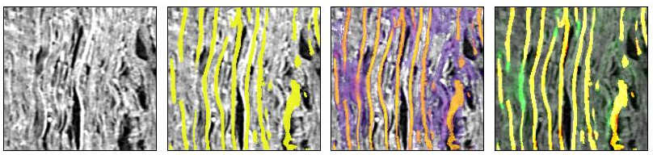

# Iterative Surface Refinement

## Abstract

> **⚠️ Faces vs medials — please read before comparing.** This detector predicts the **medial** crest of each
> sheet: a thin surface running through the sheet's centre, a few voxels inboard of the two **faces** that every
> other label — manual, or mined from m7 — annotates. This is a deliberate, different geometric target, not an
> error, and it is the main reason we report no Dice against face labels (see §11). Our position is blunt: **it is
> better to have a sheet detection whose face lives flat at a few voxels' offset than a detection that is flat at
> zero offset only in some regions and waves harshly everywhere.** A consistent, correctable offset beats
> intermittent exactness.

We present the second stage of the pipeline: a learned refiner that turns the unsupervised pseudo-labels of
the first stage into a dense, self-correcting surface predictor. The refiner is a UNet network based on m7
that generates a single map `D(CT, prev) → surface` that is applied *iteratively* — its own output at one pass becomes
the `prev` input of the next — so that structure propagates outward one window at a time and incomplete predictions are
repaired against the raw micro-CT rather than against a fixed label. Three ideas carry the design. First, the
network is never asked to remember where sheets are: a **carried orientation field**, read directly from the
structure tensor of the CT at every step, supplies — wherever the material still holds two distinct
orientations — the geometric cue that separates touching wraps, a cue any prediction that had already fused
them would have lost. Second, detection and **separation** are learned by
different terms — a symmetric detection substrate that finds surface, and a **constrained-MALIS affinity
objective** over per-sheet instance identity that grows a sheet along itself while cutting it away from its
neighbours — so that completing a sheet and merging two sheets are no longer the same gradient. Third, the
iteration itself is *taught*: a synthetic `prev` channel, composed each epoch from precomputed label variants
and then deliberately cut and fragmented, together with an online-DAgger regime in which the model conditions
on its **own** output, closes the gap between how the model is trained and how it is run. We are candid about
the limit this leaves: completing and growing sheets works, but separating two wraps that were *already* merged
— the case where the CT may itself carry no distinguishing orientation — is not yet solved, and we treat it as
the open problem it is. We situate the work
in the lineage of learned tractography, from which we take a single idea — that a network can learn to *track* a
structure through the raw signal, well beyond the explicit traces it was shown — and apply it so the refiner
grows sheets into material the pseudo-labels never reached. That those pseudo-labels carry real signal even
where they appear to fail is confirmed by the reverse experiment: *removing* their noisy parts — dropping the
"dirty" windows and substituting a segmentation-derived teacher — measurably **degraded** the refiner. The
uncurated, honestly-uncertain labels are the asset.


---

## 1. Setting: from pseudo-labels to a learned refiner

The first stage produces, per window and with no human annotation, two rasterised fields: a thin surface
**crest** and a per-voxel **sheet-instance identity**, each carrying an honest confidence. Those fields are
correct where the geometry is clean and deliberately uncertain where it is not. They are, however, *local* —
each is decoded inside a 192-voxel window from that window's own material — and they are only as complete as
the traced primitives that produced them. What they are not is a predictor: given a fresh volume they cannot be
evaluated, they do not fill the gaps a single window's tracing left behind, and they do not improve with use.

The purpose of the second stage is to distil these labels into a network that *does* all three. We take the
same detection backbone the community already trains for surface prediction (m7) and give it a second job — to
**refine** a running estimate of the surface, conditioned on the raw CT — and we train it so that applying it
repeatedly is a contraction toward a cleaner, more complete surface than any single pass, or any single
window's pseudo-label, contains.

We write the refiner as an iteration-agnostic map

```
D( CT, prev ) → surface,
```

where `prev ∈ [0,1]` is a continuous surface-probability field: at inference it is the model's own softmax
output from the previous pass; at training it is a decoded pseudo-label crest, corrupted in the ways described
in §7. Where `prev ≈ 0` — the first pass, air, or a region a previous pass missed — the map must predict from
CT alone; where `prev` is a nonzero crest it must refine it. The single most important training invariant is
that **the target is always the clean base surface**, whatever the `prev` shows: "the output is always the
truth." The model therefore never learns a fixed `prev → target` pairing; it learns to move *any* input state
toward the truth.

---

## 2. Positioning: learning to track the sheets beyond the labels

The primitives of the first stage are, literally, **tractography**: each arm of a primitive is a streamline —
an integral curve of a direction field, grown from a seed by fixed-step midpoint integration — differing from
white-matter fibre tracking only in *which* field is integrated (the sheet normal from the structure tensor,
not a diffusion ODF) and in the constraints that keep it on the sheet. We build on the learned-tractography
literature not because we lack labels — the first stage supplies them — but because that literature has already
worked out how to make a network *learn to follow a structure through the raw signal*, carrying it past the
explicit traces it was trained on. That is exactly the capability the refiner needs: to grow a sheet into the
material the labels never reached.

Poulin, Jörgens, Jodoin & Descoteaux (2019), reviewing machine learning for tractography, characterise learned
tracking as **path-based** and **local-model-free** — stepping a model along a trajectory rather than
thresholding a per-voxel model — and note that it can readily incorporate context and anatomical priors to make
**non-local** decisions a purely local method cannot. That is the capability we want for sheets: propagate a
surface using context, rather than only threshold a per-voxel score. The supervised realisation, Poulin et al.
(2017)'s *Learn to Track*, makes the mechanism concrete — recurrent networks trained to predict the next
streamline direction from the diffusion signal — but trains against **reference streamlines**, and so can only
ever reproduce the tracks it was shown.

Théberge, Desrosiers, Descoteaux & Jodoin (2021)'s *Track-to-Learn* is the idea we actually borrow. It casts
tracking as a reinforcement-learning problem: an agent learns to propagate a streamline from the local signal,
driven by a **reward** rather than by supervised targets, and so learns to track from the signal itself —
beyond, and independently of, any fixed set of reference tracks. It is the demonstration that a network can
extend a structure through the signal **further than its labels reach**.

We bring this to sheet tracing. The refiner is given the pseudo-labels of the first stage — it is not
label-free — but it is deliberately **not bounded by them**. The affinity and material-growth terms of §6 and
the iteration of §7 teach it to *track the sheet through the CT itself*: to complete a sheet across a gap, and
to extend it into unlabelled material where no pseudo-label exists, exactly as a signal-driven tracker carries
a streamline beyond its reference tracks. The labels say what a sheet *is*; the CT signal says how far each
sheet *goes*. §9 shows these two roles are complementary — and that the labels, including the noisy parts that
look like failures, are precisely what must be kept.

We fed the output of m7 to our model which completes the gaps coherently
using the idea of learned-tractography. From left to right, the CT scan, the output of m7, one iteration of our model
taking m7's output as it's `prev` input, and the difference between `prev` and our model's output.



---

## 3. The refiner as an iterated map

At inference the refiner is run as a small number of **double-buffered Jacobi passes**. Pass 0 is fed `prev = 0`
everywhere and predicts a surface from CT alone; each later pass reads the whole previous pass's
surface-probability volume as its `prev` and writes a fresh one. Information propagates roughly one window per
pass — a deliberately *local* refinement, not a global solver — which is all the structural completion the
problem needs: a sheet that a cold pass detected only in patches is, pass by pass, joined up along itself.

Between passes the tiling grid is shifted by half a stride (§10) so that the seams of one pass fall at the
confidently-predicted centres of the next and are healed. This half-shift is the *spatial* counterpart of the self-conditioning taught at training
time (§7.3): the model repeatedly meets a `prev` whose octants were produced by different neighbouring windows,
and must reconcile them.

The network is a stock nnU-Net ResEnc backbone, warm-started from m7 (§5) and extended,
so that a model already good at *detecting* surface is re-tasked to *refine* it.

---

## 4. The carried orientation field

A refiner that conditions on its own previous output risks a specific failure: once two touching wraps have
been fused in `prev`, nothing in a purely intensity-driven input tells the next pass they were ever two. The
intended fix is to give the network, at every pass, the one cue that survives the fusion — the **local
orientation of the material** — read directly from the CT rather than from any prediction.

Concretely we append, to the `[CT, prev]` input, **six orientation channels**: the entries of the unit-trace
**structure tensor** of the CT, `[J_zz, J_yy, J_xx, J_zy, J_zx, J_yx]`, computed by the same
derivative-of-Gaussian-and-integrate operator used throughout the first stage (a small differentiation scale, a
larger integration scale), and normalised by its trace so only the *shape* of the local orientation
distribution — not the intensity — is carried. The field is **recomputed inside the forward pass from the
augmented CT**, never stored: whatever spatial augmentation the CT underwent, the orientation the network sees
is the orientation of *that* CT, automatically consistent. It is deliberately **sign-free** — the tensor is
even under `n̂ → −n̂` — because within a window there is no information about which way the scroll's centre lies.

We read the field from the CT rather than from any prediction because, *where the material retains two distinct
orientations*, the CT keeps them even when a detector has fused the two wraps into a single crest — whereas an
orientation read off the prediction would inherit that fusion and average the two normals into one. That is the
case the carried field is meant to help: the separating cue is still present in the input even though the
prediction has lost it. (Reading it from the CT is also what lets the field transform correctly under
reflections, the basis for the test-time mirror augmentation of §10.)

We are explicit, though, that this is where the method is weakest, and that it faces **two distinct failure
modes**, neither yet solved. The first, and the more fundamental, is that the cue is **not always there to
carry**. In the most severely compressed regions two wraps are pressed close enough that the *material itself*
has no locally distinguishable orientation — the structure tensor sees a single coherent direction, exactly as
it would for one genuine sheet — and then the input carries no separating signal at all. No amount of
downstream machinery can recover, from such a window in isolation, a distinction the CT does not contain; only
**non-local** evidence — an adjacent window where the same two wraps *do* separate, carried in across passes —
could, and doing that reliably is still ahead of us. The second failure mode is that even where the cue *is*
present, getting the model to **act** on it and pull an already-merged pair apart is the hardest thing we ask
of the refiner, and the current model does not do it reliably. The constrained-MALIS objective of §6.2 and this
orientation input are the machinery aimed at both. Growing and completing sheets through gaps works well (see
the result in §2 and the discussion in §9); but **separating sheets that were already merged — whether because
the cue is absent from the window or because the model fails to use a present one — is an open problem we are
actively working on**, not a solved capability we report. We flag it here so that nothing in the sections that
follow is read as claiming the merge case is closed.

---

## 5. The affinity head and instance separation

The backbone we start from is **m7**. It is a single-channel `[CT] → surface` model, and a strong *detector* —
which is exactly why we build on it rather than from scratch. Warm-starting copies its
encoder and decoder verbatim and **stem-expands** its first convolution from one input channel to eight (the CT
weight is placed on channel 0; the `prev` and six orientation channels start at zero), so the refiner begins
life predicting exactly what m7 predicted and departs from there.

To the shared decoder we attach a second, full-resolution **affinity head** — a 1×1×1 convolution off the last
decoder feature map — so the network emits two things at once: the surface segmentation `seg`, and a field of
per-voxel **affinities** `aff ∈ [0,1]`, one channel per spatial offset, each predicting whether a voxel and its
offset neighbour belong to the *same sheet*. Detection and instance-separation thus read from the same features
but are supervised by different losses (§6), so that "there is surface here" and "these two surfaces are the
same sheet" are decoupled.

---

## 6. The loss stack

Three families of term act together: a detection substrate on `seg`, a topological separation objective on
`aff`, and a data-driven growth term on `aff`. Only the first is inherited from the single-pass ablation; the
latter two are what make the refiner an *instance* model rather than a thicker detector.

### 6.1 Detection substrate: symmetric Focal–Tversky, separation, skeleton-recall

The detection loss is the same stack the single-pass surface model uses, so that model and refiner differ only
in machinery, not in what "surface" means. It composes, from the inside out,

```
DeepSupervision( SkeletonRecall( Separation( DC_and_CE( CE + Focal–Tversky ) ) ) ),
```

evaluated with the `ignore` label masked out. The core is nnU-Net's `DC_and_CE` with the Dice term replaced by
a **Focal–Tversky** term, `TI = TP / (TP + αFP + βFN)`, `loss = (1 − TI)^γ`. The important choice is that this
term is **symmetric**, `α = β = 0.5`: a recall-tilted Tversky (`β > α`) and the skeleton-recall term below
*both* push activations upward, and together they collapse the prediction into an all-ones mush; setting
`α = β` re-tasks Tversky purely as the **precision** term and leaves recall and anti-merge to the two dedicated
terms. Recall is supplied by a **skeleton-recall** term (a clDice soft-skeleton recall: reward covering the
GT medial skeleton, `Σ(P_surf · skel(GT)) / Σ skel(GT)`, ignore-masked), which rewards covering the thin GT
medial without penalising anything off it. Anti-merge is supplied by a **separation penalty**: the
morphological closing of the surface minus the surface itself, restricted to voxels the label calls background,
identifies the thin inter-sheet **gaps**, and the term penalises predicted surface-probability inside them.
Because `ignore` and `surface` are excluded from the gap by construction, the penalty never fires inside a
collapsed or crossing region the label has already marked uncertain.

### 6.2 Constrained MALIS on the affinity field

The separation penalty of §6.1 is local — it protects gaps a morphological closing can see. Long-range
membership ("these two crests, a millimetre apart, are the same wrap") is learned instead by a **constrained
MALIS** objective (Maximin Affinity Learning; Turaga et al. 2009), in its constrained two-pass form
(Funke et al. 2018), over the per-sheet instance identity the first stage provides.

MALIS scores an affinity field by its effect on **segmentation topology**: the predicted connectedness of two
voxels is the *maximin* edge — the weakest affinity on the strongest path between them. Two passes shape it.
A **positive (attractive)** pass considers only within-sheet pairs and pushes their maximin edge up, which
grows and completes each sheet along itself and is long-range by construction. A **negative (repulsive)** pass
first fuses each ground-truth sheet, then finds the maximin edge *between* different sheets and pushes it down —
cutting the one weak link that would let a merge happen. The maximin edges are found exactly with Kruskal's
algorithm over a union–find, so no external MALIS dependency is needed; the ground truth is the mesh-Voronoi
instance id per voxel, with background and `ignore` voxels excluded from all pairs. Affinities are predicted at
short, mid and long offsets (the three nearest neighbours plus offsets of 3 and 9 along each axis), and the
loss is evaluated on a random sub-crop per step to bound the sort-and-union cost. Its weight is **ramped** from
zero over the first epochs, so the network first learns to *detect* on the warm-started substrate and only then
learns to *separate*, rather than being torn between the two from initialisation.

### 6.3 CT-material growth and air-suppression

MALIS is supervised only where the sparse instance labels reach. To complete sheets through the large
**unlabelled** stretches of real material between labelled windows — and to forbid growth into air — a third
term drives the same affinity field directly from the dense CT, with no labels at all. A smooth material
scaffold `m(x) = σ((CT − τ)/s)` is read off the normalised CT (high on papyrus, low in air). An edge is asked
to **grow** (affinity → 1) with weight `m(u)·m(v) · along` where `along = 1 − δ̂ᵀJδ̂` is high when the offset
runs *along* the sheet tangent — so growth completes sheets **in-plane, through material, wherever the data
demands it**, while across-normal growth is left to MALIS so that stacked sheets are never bridged. Complementarily,
an edge with either endpoint in air is asked toward **zero** (`weight = 1 − m(u)m(v)`), a hard no-grow through
voids. Both weights are data-derived and detached from the gradient; the term, too, is ramped in. The
combination is what lets the refiner extend a sheet confidently across a gap the pseudo-label never covered,
without hallucinating sheets in air — a property we check directly with a per-epoch validation cross-section
that overlays prediction, label and the material gate on the CT.

---

## 7. Teaching iteration: the synthetic `prev` channel

The refiner is only useful if applying it repeatedly improves the result, and that is a property of *training*,
not of architecture. The danger is a train/inference mismatch: if the model only ever sees clean,
label-derived `prev` fields, it never learns to repair the incomplete, slightly-wrong `prev` it will actually
feed itself at inference. Two mechanisms close that gap. Both rest on the same discipline: whatever the `prev`,
the **target is the clean base surface**, so every corruption below is something the loss asks the model to
fix.

### 7.1 Octant composition

At label-generation time each window stores, besides its clean base crest, a small set of **candidate** fields:
merge and split *augmentation variants* of the same window, each a valid decoded crest. Every epoch, a
transform composes the `prev` channel afresh from these candidates. With some probability the whole window is
zeroed — the bootstrap / first-pass regime, teaching cold prediction from CT. Otherwise the window is split into
**2×2×2 octants** at a jittered centre and each octant is filled from an **independently sampled** candidate
(sometimes zero, sometimes the clean base, sometimes an augmentation). The result is a plausible-but-
inconsistent `prev` whose pieces disagree across a "+"-seam at the window centre — which is exactly the
inference geometry, where a half-shifted window's octants were written by different previous-pass windows. The
model is thereby taught to trust the CT over an inconsistent prior and to reconcile the seam. Crucially the
composition only ever *selects and stitches already-valid candidate fields*; it never invents geometry.

### 7.2 Fragmentation: masked-autoencoding on `prev`

A refiner trained only to denoise a mostly-complete `prev` will thin and tidy its input but will not
**re-connect** what a previous pass left broken. To teach gap-bridging we apply structured dropout to the
composed `prev` — and to `prev` **only**, leaving the target and loss mask untouched, so the clean label still
supervises every cut voxel as surface and the loss penalises failing to re-fill it. That penalty *is* the
bridge-the-gap signal. Two modes alternate: **oriented slabs and boxes** sever a sheet into disconnected
sections at random angles (within-window completion, both ends visible — interpolation); and a **half-space
cut** removes all `prev` on one side of a random plane, leaving a sheet entering from a single edge and forcing
the model to **extrapolate** it into unknown territory — the cross-window skill the half-shifted inference tiling
demands. This is structured masked-autoencoding on the prior channel, and it is what converts an iteration that
merely cleans into one that also grows.

### 7.3 Online DAgger: conditioning on the model's own output

Octant composition and fragmentation still start from *label-derived* crests. The remaining mismatch — that at
inference the `prev` is the model's **own**, differently-flawed output — is closed by online DAgger. With some
probability a training step first runs a few `no_grad` warm-up forwards, each feeding the model's own
surface-probability back in as `prev` (exactly the inference recurrence), and only then takes one graded forward
on that self-generated `prev`, with the loss on it. The warm-up passes hold no activations, so the step costs
little more memory than a single-pass run, and running more of them teaches repair at deeper iteration depths
for a few cheap forwards; there is no back-propagation through the recurrence — the self-`prev` is detached,
matching "apply the loss on the second pass." Because the warm-up's starting state still comes from the octant/
fragment composition, the self-outputs the model must repair are diverse — cold, label-like, and cut — so the
regime covers the full range of states a real iteration passes through.

We keep the split-teaching honest with one asymmetry: **split** augmentation variants, which pair a split `prev`
with a single-sheet target and would therefore teach the model to *merge*, are dropped by default. Base and
**merge** variants — which teach separation — are kept. Our failure mode is over-merging; the augmentation
distribution is chosen not to reinforce it.

---

## 8. Blending m7 in the compressed regions

Our unsupervised labels are strongest where the material is well-formed and our primitives trace cleanly; they
weaken in the most **compressed** regions, where wraps are pressed to contact and even the orientation cue is
marginal. There, m7 is often the better teacher. We therefore **mine** a modest set of
m7 pseudo-labels from compressed regions and blend them in, train-only, at a small fraction of the corpus.

Because the refiner is warm-started from m7 (§5), this blend is best read as a **rehearsal** signal against
catastrophic forgetting rather than as new supervision. In the compressed regions the network could already
segment *as m7* the day training began; a small, steady diet of m7 labels there is, in effect, the corpus
reminding it — *you were able to do this here; do not forget how* — while every other window teaches it our
thinner, instance-aware crest. The blend does not hand the network a new skill so much as stop it from
*unlearning* an old one exactly where our own labels fall silent.

The recipe is deliberately conservative and is the single source of truth shared with the cleanup of §9. From
an m7 surface binary we compute m7's **own normal-coherence** (the structure tensor of the smoothed m7 mask)
and keep as positive `surface` only the coherence-gated crest (`m7 ∧ coh > τ`); the incoherent remainder
(`m7 ∧ ¬coh`) is marked `ignore`, and everything else is background. The kept label is thus m7's coherent
**face** at its native thickness — not a medial — which is a different geometric object from our thin ∇φ crest,
and that difference is itself informative (it is the labels-vs-loss variable the first stage's validation
isolates). These m7 cases carry **no instance identity**, so MALIS is silent on them (the loader supplies a
zero owner map) and their separation is left to the CT-material term; they carry no candidate crests, so their
`prev` bootstraps to zero and they train **cold** detection; and they are tagged by source so that training
logs the two populations (`our` / `m7`) separately and one can watch each actually learn. The blend is small by
design — the point is to cover the compressed regions our labels cannot, not to let a segmentation-derived
teacher dominate.

---

## 9. The herculabels carry signal even where they appear to fail

Because m7 is the stronger teacher in the most compressed regions (§8), the tempting next step is to let it
correct us wholesale: discard the windows where our label looks mushy, and where m7 clearly beats us,
**replace** our label with m7's coherent one. We built exactly that — a cleanup that, only where m7's advantage
over us exceeded a margin, either **dropped** the case or **replaced** our surface with m7's coherence-gated
label. Windows where we
were competitive, or better, were left untouched by construction.

The result was the important negative finding of this work: the cleaned corpus trained a refiner **no better
than the uncleaned one** — it regressed to the ablation that simply drops the uncertain-region supervision. The
"dirty" labels we had removed were not noise to be tidied away; they were carrying signal. Two losses
compounded. Dropping the mushy windows removed exactly the hard, compressed, ambiguous material the refiner most
needed to learn from — leaving it the easy windows it could already do. And replacing our failures with m7
overwrote our own reading of those regions — rough and honestly-uncertain, but grounded in the CT geometry —
with a segmentation-derived answer that, by our central thesis, cannot recover what the CT still carries there.
Only a small fraction of the corpus was ever touched, and even that was enough to erase the gain.

The lesson is precise, and it does **not** contradict §8. m7 is valuable as *additional* coverage where our
labels are absent or thin — extra, train-only supervision in the compressed regions our own tracing cannot
reach. It is not valuable as a *substitute* for our own labels where we already have them, however rough they
look: the herculabels carry real signal in exactly the noisy places they appear to fail, and marking those
regions uncertain and keeping them beats deleting them or overwriting them with a cleaner-looking teacher. We
therefore train on the **uncurated** corpus, keep the small compressed-region m7 blend of §8 as purely additive
coverage, and never let cleanup drop or replace our own hard cases.

> _[FIGURE PLACEHOLDER: corpus-cleanup signal loss — the cleaned/curated corpus (dropped dirty labels +
> m7-substituted failures) trained a refiner no better than the uncertain-region-dropped baseline, versus the
> uncurated corpus. To be added. WE WILL NEED TO RE-RUN THE CLEANED MODELS TO GET IMAGES... )]_

---

## 10. Inference: iterative passes and the seam-free blend

Inference runs the map of §3 for a small number of passes over a region of interest, streaming the CT from the
open-data volumes through the shared data layer and writing each pass's surface probability as an OME-Zarr so
the intermediate iterations are directly inspectable. **Within each pass**, overlapping windows are merged by a
Gaussian importance map — the same seam-free stitching the single-pass detector uses — so no within-pass grid
artefact survives. **Between passes** the grid is shifted by half the *stride*, so that each pass's window
centres land on the previous pass's overlap-centres: the seams of one pass are re-predicted at the confident
centres of the next and healed across passes. This is the **iterate → blend → iterate** loop — blend the
overlapping windows within a pass, then shift and re-iterate between passes — at a compute cost set by the
chosen overlap. Each output tile is chunk-aligned and written exactly once, so a run is reproducible and can be
split across workers without any tile ever being written twice.

---

## 11. Evaluation: why we report no single number

We deliberately publish no Dice, VOI, or leaderboard figure. This is not an omission we intend to quietly patch —
the reasons are structural, and stating them plainly is more honest than reporting a number we know would
mislead.

- **Leakage.** m7 is trained on the full published label set — 700+ Kaggle surface labels. Validating on those,
  or on anything mined from m7, scores a model against data its teacher has already seen; the figure would be
  inflated and uninformative. There is no held-out ground truth in our domain that is independent of m7.
- **Dice measures label thickness, not detection.** Dice is dominated by the *thickness* of the reference: a
  reference one voxel thicker moves the score substantially, whether or not the sheet was correctly found.
  Against labels of a different, uncontrolled thickness it reports label metrology, not surface correctness.
- **Faces vs medials — a category difference, not an error.** Every label available to us — manual, or mined from
  m7 — annotates the **face** of a sheet at its native thickness. Our pseudo-labels annotate the **medial** crest,
  a few voxels inboard of either face. An overlap metric between a medial and a face charges that constant offset
  as a miss, when it is simply the correct centre of the same sheet. (This is exactly the labels-vs-loss variable
  the first stage isolates.)
- **Human smoothness bias.** Our synthetic labels track the material closely — they follow the sheet where it
  genuinely bends, pinches, and delaminates. Human surface labels are well known to smooth: annotators draw
  cleaner, flatter sheets than the papyrus actually is. Scoring against them would penalise our labels *for
  tracking the material more faithfully than a human does* — we would lose points for doing the better job.

**The case for the medial.** We defend the medial target directly: **it is better to have a sheet detection whose
face lives flat at a few voxels' offset than a detection that is flat at zero offset only in some regions and
waves harshly everywhere.** A medial that sits a consistent few voxels inboard of the face is trivially
recoverable — a single dilation to either face — and, more importantly, it is *coherent*: it does not wander. The
alternative failure mode — a face-fitted detection that is exact where the material is easy and buckles where it
is hard — is the one that actually breaks downstream flattening and reading, because its error is *unpredictable*
rather than a constant, correctable offset. We would rather be consistently, correctably offset than
intermittently exact and intermittently wild.

**What we show instead.** In place of a scalar we show the prediction itself — on volumes m7's labels never
covered, and across the iterative passes (the figures above) — and invite the reader to judge the properties that
matter: coherence, completion of broken sheets, and separation of touching wraps. Those are precisely the
properties a single overlap number, computed against biased, differently-thick, leakage-prone labels, cannot
report.

---

## References

- Poulin, P., Jörgens, D., Jodoin, P.-M., & Descoteaux, M. (2019). *Tractography and machine learning: Current
  state and open challenges.* Magnetic Resonance Imaging, 64, 37–48.
- Poulin, P., Côté, M.-A., Houde, J.-C., Petit, L., Neher, P. F., Maier-Hein, K. H., Larochelle, H., &
  Descoteaux, M. (2017). *Learn to Track: Deep Learning for Tractography.* Medical Image Computing and
  Computer-Assisted Intervention (MICCAI).
- Théberge, A., Desrosiers, C., Descoteaux, M., & Jodoin, P.-M. (2021). *Track-to-Learn: A general framework for
  tractography with deep reinforcement learning.* Medical Image Analysis.
- Turaga, S. C., Briggman, K. L., Helmstaedter, M., Denk, W., & Seung, H. S. (2009). *Maximin affinity learning
  of image segmentation.* Advances in Neural Information Processing Systems (NeurIPS).
- Funke, J., Tschopp, F. D., Grisaitis, W., Sheridan, A., Singh, C., Saalfeld, S., & Turaga, S. C. (2018).
  *Large scale image segmentation with structured loss based deep learning for connectome reconstruction.*
  IEEE Transactions on Pattern Analysis and Machine Intelligence, 41(7), 1669–1680.
</content>
</invoke>
